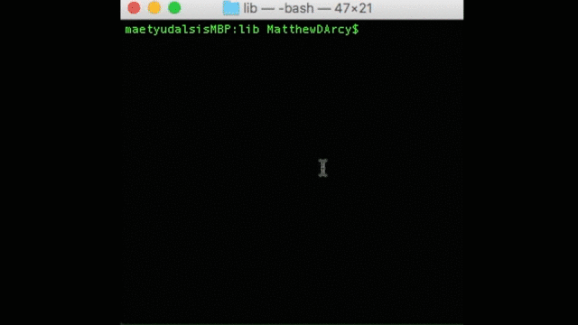

# BattleshipAI

---

A 0/1/2-player battleship game implemented in Ruby:

**Features**

* Random placement of ships for both players
* Human vs human mode
* Human vs PC mode
* PC vs PC mode
* PC guessing algorithm
* Continuous play option

**To Play**

* Clone or download repository
* With Ruby installed on your machine, navigate to directory of app.rb
  > ruby app.rb

**PC vs PC Mode**

* When asked 'Will you play the PC? (yes/no)' reply:
  > pcpc

---

© 2016 [Matt D'Arcy](http://linkedin.mathewdarcy.com), shared under the [MIT License](http://www.opensource.org/licenses/MIT).
